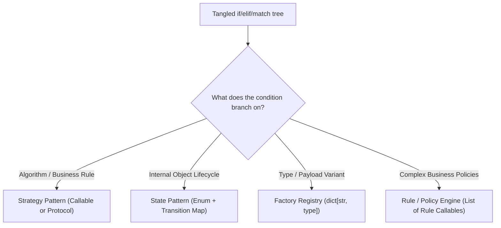

# Python Design Patterns & Clean Architecture

A practical, Pythonic decision framework for designing, evaluating, and refactoring software architecture based on **ArjanCodes** principles.

---

## The Core Heuristic: The "Rule of Three"

Modern Python favors simplicity, structural typing (`typing.Protocol`), and first-class functions over rigid object-oriented class hierarchies. Always evaluate code through Arjan's core heuristic:

```
1. Start Functional & Simple
   ├── Use simple functions, standard dataclasses, and composition first.
   └── Avoid premature abstractions, speculative interfaces, or factory hierarchies.

2. Refactor Only Upon Pain ("The Rule of Three")
   ├── 1st time: Write straightforward code.
   ├── 2nd time: Tolerate the slight duplication / branching.
   └── 3rd time: Refactor into a formal pattern when friction, duplication, or testability demands it.

3. Favor Composition Over Inheritance
   ├── Rely on typing.Protocol for structural subtyping (duck typing).
   ├── Pass Callables and closures rather than creating abstract base class (ABC) trees.
   └── Inject dependencies via constructors rather than hard-coding dependencies or using globals.
```

---

## Master Pattern Decision Matrix

Use this quick-lookup matrix to pick the right pattern or identify over-engineering:

| Problem / Requirement | Pattern / Idiom | When to Use (Green Flags) | When to Avoid (Red Flags) | Pythonic Adaptation | Reference Guide |
| :--- | :--- | :--- | :--- | :--- | :--- |
| **Dynamic algorithm switching** | **Strategy** | Multiple interchangeable business rules or algorithms at runtime (e.g. payment gateways, export formats). | Single static algorithm or trivial `if/else` that will not grow. | Pass `Callable[[Input], Output]` or closures instead of class hierarchies. | [Behavioral Guide](./references/behavioral.md#1-strategy-pattern) |
| **Loose event notification** | **Observer** | Multiple independent components react to state changes (e.g. signup triggers email, analytics, audit). | Strict synchronous/deterministic execution where call order must be linear and easily traceable. | Use `dict[type, list[Callable]]` registries with dataclass event payloads. | [Behavioral Guide](./references/behavioral.md#2-observer--event-driven-pattern) |
| **Multi-state lifecycle** | **State** | Behavior fundamentally alters across defined state transitions (e.g. order lifecycle `Pending` -> `Paid` -> `Shipped`). | Simple binary flags (`is_active: bool`, `is_admin: bool`). | Combine `enum.Enum` with transition maps and `match/case` instead of full class-per-state trees. | [Behavioral Guide](./references/behavioral.md#3-state-pattern) |
| **Deferred execution / Undo** | **Command** | Encapsulate actions for undo/redo stacks, job queues, or scheduled execution. | Immediate synchronous operations requiring no rollback, queuing, or history. | Use `@dataclass` with `__call__()` or `functools.partial`. | [Behavioral Guide](./references/behavioral.md#4-command-pattern) |
| **Fixed workflow with variable steps** | **Template Method** | Fixed multi-step skeleton where specific sub-steps vary across implementations (e.g. ETL pipeline). | Callers need to modify the execution sequence itself rather than individual steps. | Inject step callables via composition rather than subclassing an ABC. | [Behavioral Guide](./references/behavioral.md#5-template-method-pattern) |
| **Incompatible external interfaces** | **Adapter** | Integrating third-party APIs, legacy libraries, or SDKs without polluting domain models. | You own both codebases and can refactor the target interface directly. | Define a `typing.Protocol` and write thin wrapper classes or functions. | [Structural Guide](./references/structural.md#1-adapter-pattern) |
| **Cross-cutting concerns** | **Decorator** | Adding logging, timing, caching, rate-limiting, or auth without modifying base logic. | Adding core domain logic that belongs inside the entity itself. | Use Python `@decorator` syntax with `@functools.wraps`. | [Structural Guide](./references/structural.md#2-decorator-pattern) |
| **Part-whole recursive trees** | **Composite** | Treating individual objects and object collections uniformly (e.g. file trees, nested menus). | Flat data structures or where leaves and containers have drastically different APIs. | Define a uniform `typing.Protocol` with recursive processing. | [Structural Guide](./references/structural.md#3-composite-pattern) |
| **Complex subsystem simplification** | **Facade** | Providing a single high-level API over a complex multi-class subsystem (e.g. video rendering pipeline). | Callers need fine-grained low-level control over internal parameters. | Use a dedicated class or module functions orchestrating the subsystem. | [Structural Guide](./references/structural.md#4-facade-pattern) |
| **Two independent variation axes** | **Bridge** | Both abstraction and implementation vary independently ($M \times N \to M + N$). | Only one dimension of variation exists (simple polymorphism suffices). | Inject implementation protocols into abstraction classes. | [Structural Guide](./references/structural.md#5-bridge-pattern) |
| **Runtime dynamic instantiation** | **Factory** | Concrete type depends on runtime configuration, plugins, or serialized input. | Direct instantiation (`MyClass()`) is known statically at compile time. | Use dictionary registries (`REGISTRY: dict[str, type]`) and factory functions. | [Creational Guide](./references/creational.md#1-factory--abstract-factory-pattern) |
| **Complex object assembly** | **Builder** | Constructing complex objects with multi-step validation or 5+ optional configuration combinations. | Small, straightforward dataclasses or objects with standard defaults. | Use `@dataclass(kw_only=True)` or Pydantic before reaching for a full builder class. | [Creational Guide](./references/creational.md#2-builder-pattern) |
| **Single shared coordinator** | **Singleton** | Strictly one physical resource coordinator needed globally (e.g. hardware lock, shared threadpool). | General state/configuration storage (creates hidden global state and breaks test isolation). | Use Python **modules** (cached in `sys.modules`) or pass instances via Dependency Injection. | [Creational Guide](./references/creational.md#3-singleton-pattern) |
| **Testable I/O isolation** | **Dependency Injection** | Decoupling business logic from external I/O (databases, network APIs, clocks) for unit testing. | Simple standalone utility scripts where manual wiring adds pointless overhead. | Constructor injection accepting `typing.Protocol` contracts. | [Architectural Guide](./references/architectural.md#1-dependency-injection) |
| **Storage-agnostic business logic** | **Repository** | Decoupling domain logic from database/ORM specifics (e.g. swapping SQLite for PostgreSQL or in-memory fakes). | Simple CRUD apps where the ORM (SQLModel, Django ORM) is already the primary abstraction. | Define a `Protocol` repository interface with separate concrete implementations. | [Architectural Guide](./references/architectural.md#2-repository--unit-of-work) |
| **Sprawling argument lists (4+)** | **Parameter Object** | Functions or methods with 4+ parameters that frequently travel together. | Functions taking 1-2 self-explanatory primitive arguments. | Group parameters into a dedicated `@dataclass(frozen=True)`. | [Architectural Guide](./references/architectural.md#3-parameter--context-object) |
| **Evolving validation rules** | **Rule / Policy Engine** | Business domains with rapidly evolving validation rules or qualification criteria (e.g. loan approval). | Static rule sets that rarely change and fit in standard boolean conditions. | Compose callable rule predicates returning typed results. | [Architectural Guide](./references/architectural.md#4-rule--policy-engine) |

---

## Agent Action Workflows

### Workflow 1: Pre-Implementation Architecture Planning
When planning a new feature or module:
1. **Analyze the problem type**: Is it an algorithmic variation (Strategy), an event broadcast (Observer), a multi-step lifecycle (State), an I/O boundary (Adapter/Repository), or a complex assembly (Builder/Factory)?
2. **Apply the Rule of Three**: Is this the first instance? If yes, start with a simple function or dataclass. Do not build an abstract hierarchy for a single implementation.
3. **Choose the Pythonic abstraction**:
   - Prefer `typing.Protocol` over `abc.ABC` to avoid explicit inheritance coupling.
   - Prefer `Callable` types over single-method class interfaces.
   - Prefer `@dataclass(frozen=True)` for data structures and parameter grouping.
4. **Design the testing seam**: Ensure I/O dependencies are passed into constructors or functions so tests can supply in-memory fakes without patching.

---

### Workflow 2: Code Evaluation & Smell Audit
When evaluating existing code or PRs:
1. **Detect Runaway Conditionals**: Search for `if/elif/elif` chains checking type tags or operation codes. If >= 3 branches exist and new ones are expected, refactor to a **Strategy dictionary** or **State transition map**.
2. **Detect Sprawling Parameter Lists**: Check functions with >= 4 arguments. Refactor to a **Parameter Object** dataclass.
3. **Detect Direct I/O in Domain Logic**: Check if business logic directly calls `requests.get()`, `boto3`, or database drivers. Introduce a **Protocol + Adapter/Repository** to restore testability.
4. **Detect OOP Over-Engineering (Java Slop)**: Check for:
   - Single-method classes that should be pure functions.
   - Abstract factories with only one concrete implementation.
   - Classical `Singleton` classes using `__new__` hacks instead of module-level instances.
   - Deep inheritance trees (>2 levels) that should be flattened using composition.

---

### Workflow 3: Refactoring Conditionals to Patterns
When converting tangled procedural logic:



---

## Reference Documentation

- [Behavioral Patterns Reference](./references/behavioral.md): Strategy, Observer, State, Command, Template Method.
- [Structural Patterns Reference](./references/structural.md): Adapter, Decorator, Composite, Facade, Bridge.
- [Creational Patterns Reference](./references/creational.md): Factory, Builder, Singleton.
- [Modern Architectural Idioms Reference](./references/architectural.md): Dependency Injection, Repository, Parameter Object, Rule Engine.
- [Anti-Patterns & Rationalization Buster](./references/anti_patterns.md): Common rationalizations, red flags, and over-engineering traps.
